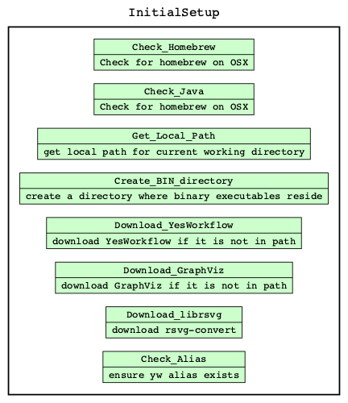
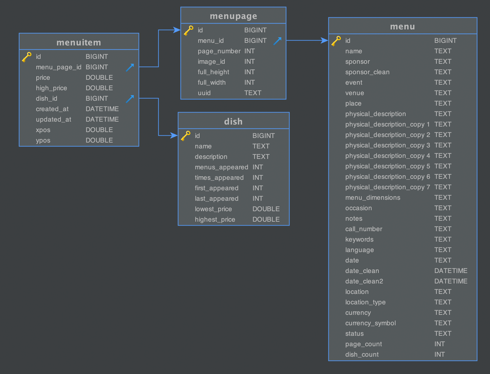

---
puppeteer:
    landscape: false
    format: "A4"
    printBackground: true
    preferCSSPageSize: true  
    margin:
        left: 0
        bottom: 0


---

# Theory and Practice of Data Cleaning Final Project - NYPL Menus

**Author**: jamesmb3@illinois.edu

**Date**: 07/25/2019

**Data Directory**: https://uofi.box.com/s/onxbn0ar8b86ym8lj8jkr6of5m2h5khh

***


# Introduction

This report will summarize the data provenance and workflow of the [New York Public Library What's on the Menu?](http://menus.nypl.org/about)  The report will document and show the various techniques learned in class and how they can be applied to this type of data.  Several tools were made available through coursework as well as additional tools used are listed below.


# Git'ing the code

The entire contents of the repository is made available on [github](https://github.com/itsjimbo/CS_498_Final_Project).  Clone the repository to download the entire project.

```bash
git clone https://github.com/itsjimbo/CS_498_Final_Project
```

# Tools

To reproduce this report in its entirety, the following tools must be installed.  

- **Atom** - A hackable text editor for the 21st Century [download](https://atom.io/) - used [Markdown Preview Enhanced](https://shd101wyy.github.io/markdown-preview-enhanced/#/) package for markdown and prince for pdf conversion.
- **DBVisualizer** - Free Universal database tool for developers, DBAs and analysts. (ER-diagram)
[download](https://www.dbvis.com/)
- **OpenRefine** - powerful tool for working with messy data: cleaning it; transforming it from one format into another; and extending it with web services and external data. Download it here:
	- [Windows](https://github.com/OpenRefine/OpenRefine/releases/download/3.2/openrefine-win-3.2.zip)
	- [Mac](https://github.com/OpenRefine/OpenRefine/releases/download/3.2/openrefine-mac-3.2.dmg)
	- [Linux](https://github.com/OpenRefine/OpenRefine/releases/download/3.2/openrefine-linux-3.2.tar.gz)
- **SQLite** - SQLite is a C-language library that implements a small, fast, self-contained, high-reliability, full-featured, SQL database engine - [download](https://www.sqlite.org/download.html)
- **SQLITE Studio** -  SQLite database manager with many features including a simple GUI [download](https://sqlitestudio.pl/index.rvt)
- **YesWorkFlow** - Bringing workflow modeling and provenance management to scripting languages - https://github.com/yesworkflow-org/yw-idcc-17.  The `YesWorkFlow` can be installed using the included `setup.sh`
- **or2ywtool** - Openrefine to Yesworkflow model tool for python - [download](https://pypi.org/project/or2ywtool/)


# Overview and initial assessment

The [New York Public Library](http://menus.nypl.org/about) has collected information about various menus from the 1840's until present that contain information about dishes and prices.  Starting in 2011, the NYPL had begun to [digitize](https://digitalcollections.nypl.org/collections/the-buttolph-collection-of-menus#/?tab=about) the collection of 45000 artifacts and continue to grow.  Individual tables are listed in the `Dataset` section of the report.


# BYOY - Bring Your Own YesWorkFlow

An initial bootstrap `setup.sh` is included as convenience to bootstrap the environment on OSX. The following operations are conducted in order to provide the basic structure to replicate this report. Included checks for other packages such as GraphViz and LibrSVG for easy document reproducibility.




# Dataset

The dataset was provided as a zip file from the coursera course page materials available [here](https://www.coursera.org/learn/cs-513/supplement/91DaU/data-cleaning-project) and consists of 4 files along with the initial primary and foreign key constraints:

- **Menu**  - A `Menu` is an individual container for all the other data elements and contains a unique id. Other metadata about the venue or event that the menu was created for, the location, and currency are also included. Each `Menu` is associated with some number of `MenuPage` items.
	* `Menu:id` primary key
	* `MenuPage:menu_id`  &rarr;  `Menu:id`


- **MenuPage**  - A `MenuPage` is a page from the `Menu` - each page is associated with one or more `MenuItems`.
	* `MenuPage:id` primary key
	* `MenuItem:menu_page_id` &rarr; `MenuPage:id`


- **MenuItem**  -A `MenuItem` is an area of the menu which encompasses xy coordinate location of the item being represented along with the price.  Each `MenuItem` is associated with the `Dish` that it represents.
	* `MenuItem:id` primary key
	* `MenuItem:menu_page_id` &rarr; `MenuPage:menu_id`
	* `MenuItem:dish_id` &rarr; `Dish:id`


- **Dish**  - A `Dish` is the most granular represented item.  Each dish consists of properties like name and description and has price and date ranges as well.
	* `Dish:id` primary key
	* `MenuItem:dish_id` &rarr; `Dish:id`


<div style="page-break-after: always;"></div>

### Entity Relationship diagram

The Entity Relationship (ER) Diagram is depicted below.




# Row Counts

Before we started, it is generally good practice to get an idea of how much data we are dealing with, and to have some baseline to compare counts to.  Below is the table of counts for all files that we were given.

| Filename        | Rows    |
|-----------------|---------|
|   Menu.csv     | 17547   |
|   MenuItem.csv   | 1332726 |
|   MenuPage.csv | 66937   |
|   Dish.csv      | 423400  |


# Data cleaning with OpenRefine


### JVM Memory options

Consider increasing beyound the default specifications for the JVM. Edit the `Info.plist` properties and change the -Xmx arguments for the JVM.

```bash
$ vi  /Applications/OpenRefine.app/Contents/Info.plist
```
```xml
<key>JVMOptions</key>
<array>
	...
	<string>-Xms512M</string>
	<string>-Xmx8192M</string>
	...
</array>
```


- **Menu** - `id` `menu_id` `page_number` `image_id` `full_height` `full_width` convert to number to ensure numeric


- **MenuPage** - `id` `menu_id` `page_number` `image_id` `full_height` `full_width` convert to number to ensure numeric

- **MenuItem** -
The created at and updated at columns were cleaned as date column of Menu file.


- **Dish** - name was the most difficult column to perform operations on - I switched to python notebook to perform some clustering.


### Clustering Considerations and Assumptions

Attempts to cluster the data appropriately were taken, however without more detail investigation will need to be performed to validate the actual name.  From the example below, there may exist both `IMPERIAL HOTEL` and `Hotel Imperial` as both are legitimate possibly different hotel names.  Since there was no physical street address or other corroborating information we can utilize to make discernible differences (such as more recent GPS coordinates), and given that names can change tremendously through time - we may  want to consider clustering these utilizing addition methods in the future.  


### Clustering Challenges wihtin OpenRefine

The `dish` table has presented some challenges to OpenRefine for clustering because of the number of records and limitations to CPU.  Similar operations were performed within the python notebook for clustering.


# Develop a relational database schema

### Create Schema

In an effort to preserve data types for the columns when importing into `sqlite`, we would need to remove the header row - but we wanted to have the sql autogenerated.  The easiest way to accomplish is to
* export as CSV within `OpenRefine`,
* import the table into `sqlite`,
* dump the schema from the imported csv (all datatypes are TEXT),
* drop the table,
* edit the schema and change data types,
* remove the header information via `sql/remove_headers.sh` script which uses a `sed` expression to remove the row of each file
* create the table with data types
* import the header-less csv into our table with data types

Below we will demonstrate an example that was repeated for all tables.

###### Extract column information from CSV to SQL, import and DROP
```sql
-- First extract columns from the csv
-- all datatypes will be text
sqlite> .mode csv
sqlite> .import ../data/clean/menupage.csv menupage
sqlite> .schema menupage
CREATE TABLE menupage(
  "id" TEXT,
  "menu_id" TEXT,
  "page_number" TEXT,
  "image_id" TEXT,
  "full_height" TEXT,
  "full_width" TEXT,
  "uuid" TEXT
);
sqlite> drop table menupage;

```

###### Remove header row from the CSV file
```bash
# simple script to remove headers on csv files
sed -i '' 1d ../data/clean/menu.csv
```

###### Create with data types
We then can create the table and preserve the data types

```sql
CREATE TABLE menupage(
  "id" BIGINT,
  "menu_id" BIGINT,
  "page_number" INT,
  "image_id" INT,
  "full_height" INT,
  "full_width" INT,
  "uuid" TEXT,

);
```

###### Import Data
And finally import all of the rows to prepare it for our next step.  Data will the be imported correctly with the data types we have given in the previous step.

```sql
-- change mode to csv to import
.mode csv
.import ../data/clean/menu.csv menu
```


### Rebuilding the entire dataset

The entire `sql/create.sql` is included for reproducibility to execute the script - change into the `sql` directory and run `start.sh`

```bash
# example
cd ~/git/final-project/sql
$ ./start.sh
SQLite version 3.24.0 2018-06-04 14:10:15
Enter ".help" for usage hints.
sqlite> .read create.sql
```


### Create Constraints

We will first look at indivudal constraints on each table and then look at the __three__ relationships joining the __four__  tables.


- **dish**  - table constraints
	* `id` primary key - distinct - no duplicates - not null
		```sql
		select id,count(*) from dish group by id having count(*)>1;
		select * from dish where id is NULL;
		```
	* `menus_appeared` and `times_appeared` should be a value __greater than__ 0

		```sql
		 select first_appeared,last_appeared,count(*) from dish where
		 (first_appeared not between 1851 and 2012) and (last_appeared  not between 1851 and 2012)
		 group by first_appeared,last_appeared;
		```

		|     first_appeared   |     last_appeared |     count |
		|----------------|---------------|----------|
		|   0  | 0   | 55278|
		|   1              | 1             | 37       |
		|   1              | 2928          | 4        |
		|    2928           | 2928          | 11       |


		We can see from the table we have strange values for these observations, perhaps we would want to exclude them reporting.

		Instead of removing we can create a new column called `REPORTING_DATA_QUALITY_SCORE` and assign various values to have some accepting value prior to reporting exclusion.  This way we can maintain the original values for comparison and error checking in the future when more data might be added.


	*  `lowest_price` should always be __less than or equal__ `highest_price`
		```sql
		select * from dish where lowest_price > highest_price;
		```

- **menuitem**  - table constraints
	* `id` primary key - distinct - no duplicates - not null
		```sql
		select id,count(*) from menuitem group by id having count(*)>1;
		select * from menuitem where id is NULL;
		```
	* `xpos` and `ypos` should be __greater than__ 0 and __NOT NULL__
		```sql
		select * from menuitem where (ypos<0 or ypos IS NULL) and (xpos<0 or xpos is NULL);
		```
	* `price` should be __greater than__ 0 and __NOT NULL__
		```sql
		select * from menuitem where price<0 or price IS NULL;
		```
	* `price` should not exceed `high_price` where `high_price` is populated
		There are `320` records that fail this condition, and having a high_price that is less than the current price may pose a problem.  We can correct this by updating, reducing quality score or removing.

		```sql
		select price,high_price,count(*) as cnt from menuitem where price>high_price and
		--where high_price is populated
		(high_price is NOT NULL) and (high_price <>'')
		group by price,high_price
		order by cnt desc
		```

		|      price | high_price | cnt |
		|-------|------------|-----|
		|   0.5   | 0.3        | 69  |
		|   0.6   | 0.35       | 60  |
		|   0.75  | 0.4        | 54  |
		|   0.4   | 0.25       | 47  |
		|   2.5   | 1.25       | 45  |
		|   1.0   | 0.6        | 32  |
		|   2.0   | 1.0        | 30  |
		|  ...   |...    | ...  |


- **menupage**  - table constraints
	* `id` primary key - distinct - no duplicates - not null
		```sql
		select id,count(*) from menupage group by id having count(*)>1;
		select * from menupage where id is NULL;
		```

- **menu**  - table constraints
	* `id` primary key - distinct - no duplicates - not null
		```sql
		 select id,count(*) from menu group by id having count(*)>1;
	 	 select * from menu where id is NULL;
		```
	* `page_count` should not be blank or null
		```sql
		 select * from menu where page_count = 0 or page_count is NULL;
		```
	* `status` should be __complete__ or __under review__

		```sql
		 select status,count(*) from menu group by status;
		```

		|    status       | count |
		|--------------|-------|
		|    complete     | 17371 |
		|    under review | 174   |


	* `sponsor` should not be blank or null

		Several rows have missing sponsor data perhaps which should be removed or the data `REPORTING_DATA_QUALITY_SCORE` should be lowered.

		```sql
		 select * from menu where sponsor is NULL or sponsor='' LIMIT 4;
		```

		|        id      |name|sponsor|event|location                                                             |status  |page_count|
		|-----|----|-------|-----|---------------------------------------------------------------------|--------|----------|
		|   19708|    |       |     |OCCIDENTAL & ORIENTAL STEAMSHIP COMPANY                              |complete|4         |
		|   19712|    |       |     |PACIFIC MAIL STEAMSHIP COMPANY                                       |complete|2         |
		|   21128|    |       |     |MAIL STEAMSHIP COMPANY                                               |complete|4         |
		|   21274|    |       |     |HAMBURG AMERIKA LINIE                                                |complete|4         |

- **menupage:menu_id** &rarr; **menu:id**
	* `menu_id` from `menupage` should exist as `id` within the `menu` table

		Here there are `5803` rows that fail a reverse lookup and do not have corresponding menu `id`'s.

		```sql
		 select count(*) from menupage t1  left join menu t2 on (t1.menu_id=t2.id)
		 where t2.id is null
		```
		|     count  |
		|----------|
		|      5803     |

		Going the other way - all menus `id`'s are represented within the `menupage` table
	 	```sql
		 select count(*) from menu t1  left join menupage t2 on (t1.id=t2.menu_id)
		 where t2.menu_id is null
		```
		|     count  |
		|----------|
		|      0     |


- **menupage:id** &rarr; **menuitem:menu_page_id**
	 * `menu_page_id` from `menuitem` should exist as `id` within the `menupage` table


		Here we see `40347` rows that we have menupage's for, but do not have corresponding menuitems

		```sql
		 select count(*)  from menupage t1  left join menuitem t2 on (t1.id=t2.menu_page_id)
		 where t2.menu_page_id is null
		```

		|     count  |
		|----------|
		|      40347     |

		Going the other way - all menuitem `menu_page_id`'s should be represented in `menupage` `id`
	 	```sql
	   select count(*) from menuitem t1  left join menupage t2 on (t1.menu_page_id=t2.id)
		 where t2.id is null
		```
		|     count  |
		|----------|
		|      0     |


- **dish:id** &rarr; **menuitem:dish_id**
	 * `dish_id` from `menuitem` should exist as `id` within the `dish` table

		Here there are `9262` rows that we have `dish_id`'s for, but do not have corresponding menuitems represented
		This may be sufficient to look past - perhaps we have dishes that are not on menus - however we must question how we got this data.

		```sql
		 select count(*) from dish t1  left join menuitem t2 on (t1.id=t2.dish_id)
		 where t2.dish_id is null
		```
		|     count  |
		|----------|
		|      9262     |


		There are also `241` rows where dish_id is missing, perhaps this is a empty menuitem?

		```sql
		 select count(*) from menuitem t1
		 where t1.dish_id is null or t1.dish_id =''
		```
		|     count  |
		|----------|
		|      241     |


		Going the other way - all menuitem `dish_id`'s should be represented in `dish` `id`

	 	```sql
		select count(*) from menuitem t1  left join dish t2 on (t1.dish_id=t2.id)
		where t2.id is null and (t1.dish_id is not null and t1.dish_id<>'')
		```
		|     count  |
		|----------|
		|      3    |

		Here we have `3` records that are not begin represented in the dish table - again we should question and validate how this is happening, these records would have to be removed or have a low `REPORTING_DATA_QUALITY_SCORE`


# Create a workflow model


### Individual table flow

The `or2yw` tool was used to generate the png information from the json exported from `OpenRefine` for individual tables.  The included shell script `generate-png.sh` was used to perform the execution.  

```bash
# example
$ ./generate-png.sh menupage
java found:  java
dot found:  dot
File images/menupage.yw.png generated.
```

- **dish**  
	See the attached [notebook container python/NYPL_MENUS.ipynb](python/NYPL_MENUS.ipynb) that demonstrates basic operations on the `dish` table.  The values for the name were too large for OpenRefine for my machine - so I had to try another route.

- **menuitem**  
	

- **menupage**
	

- **menu**
	


# Data Cleaning results


For this exercise we create a `REPORTING_DATA_QUALITY_SCORE` that has initial value of 1 (acceptable for reporting) and we utilize other integer values to explain why we should not include this for reporting.  We join this to a metadata table to display summary information.


```sql
select t2.*,count(*) from menu t1 left join data_quality_score t2
on (t1.REPORTING_DATA_QUALITY_SCORE=t2.score)  group by t1.REPORTING_DATA_QUALITY_SCORE
```
| score | description           | error_level | count(*) |
|-------|-----------------------|-------------|----------|
| 1     | Record OK             | info       | 15984    |
| 12    | menu sponsor is blank | error       | 1561     |


```sql
select t2.*,count(*) from dish t1 left join data_quality_score t2
on (t1.REPORTING_DATA_QUALITY_SCORE=t2.score) group by t1.REPORTING_DATA_QUALITY_SCORE
```
| score | description                                          | error_level | count(*) |
|-------|------------------------------------------------------|-------------|----------|
| 1     | Record OK                                            | info        | 363524   |
| 11    | dish last_appeared or first_appeared not 1851 - 2012 | error       | 50611    |
| 14    | dish REFERENCES UNKNOWN menuitem                     | error       | 9262     |


```sql
select t2.*,count(*) from menuitem t1 left join data_quality_score t2
on (t1.REPORTING_DATA_QUALITY_SCORE=t2.score) group by t1.REPORTING_DATA_QUALITY_SCORE
```
| score | description                      | error_level | count(*) |
|-------|----------------------------------|-------------|----------|
| 1     | Record OK                        | info        | 1332164  |
| 10    | menuitem price>high_price        | error       | 318      |
| 15    | menuitem REFERENCES BLANK dish   | warning     | 241      |
| 16    | menuitem REFERENCES UNKNOWN dish | error       | 3        |


```sql
select t2.*,count(*) from menupage t1 left join data_quality_score t2
on (t1.REPORTING_DATA_QUALITY_SCORE=t2.score) group by t1.REPORTING_DATA_QUALITY_SCORE
```

| score | description                          | error_level | count(*) |
|-------|--------------------------------------|-------------|----------|
| 1     | Record OK                            | info        | 26590    |
| 13    | menupage REFERENCES UNKNOWN menuitem | error       | 40347    |


# Data quality issues


We have seen some data missing in the tables given (as orphans or no children)- we would have to review these items and determine the source of the error - perhaps it was from a source that can be easily corrected - or we would end up removing the data - or - this could be a larger sign that something might be wrong with data collection process itself and could warrant further investigation.

This dataset may also be subject to human error as well - we acknowledge in collecting data from humans some dates such as 1900 or 1999 may be entered mistakenly - software has been known to pre-fill default values with such numbers and because this dataset spans such a large timeframe it may be prone to those mistakes.

Some values such as `menu:sponsor` are blank and typically in a production system we would want to rectify these problems, either by removal or by attributing a low  `REPORTING_DATA_QUALITY_SCORE` to this data.  If it happens to be form data, perhaps validation on the front-end may be installed to prevent these types of errors.


# Conclusions and Future Work

This report summarizes a feasible amount of cleaning required for this dataset to represent it.
Future work may include:

-  additional graphs and charts to show data consistency
-  additional datasets to help corroborate information for the historical time - this may be location information or additional menu information
- `dish:name` presents much opportunity for clustering via alternative methods - I have included the python notebook `python/NYPL_MENUS.ipynb` for sampling clustering - perhaps using CUDA will show improved operations time in the future.

I have also tried to utilzed [refine-client-py](https://github.com/dbutlerdb/refine-client-py) within python - a seperate fork for python3, but it appears some work still needs to be done - I could list projects and perform simple operations but was getting errors on facet building.   I may take a look at the source and fix the client it would be useful to run openrefine commands directly from python notebook and manipulate the data.

We have seen that using a workflow for data provenance such as YesWorkFlow can be beneficial for flow generalization, especially when working with highly complex algorithms and data sets.  Introducing a YesWorkFlow as a standard for development may help to solve code duplication perhaps even replace the standards of documentation.

# Acknowledgements
This report acknowledges [Prof. Bertram Ludäscher](https://experts.illinois.edu/en/persons/bertram-lud%C3%A4scher) for his expertise in the subject area and his guidance has been invaluable.


# Further reading

[Using OpenRefine](https://books.google.com/books/about/Using_OpenRefine.html?id=_WG1AAAAQBAJ&printsec=frontcover&source=kp_read_button#v=onepage&q&f=false) - Ruben Verborgh, Max De Wilde
