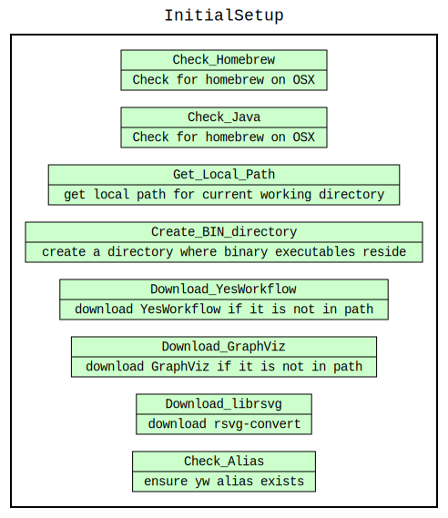

# Introduction

This report will summarize the data provenance and workflow of the [New York Public Library What's on the Menu?](http://menus.nypl.org/about)  The report will document and show the various techniques learned in class and how they can be applied to this type of data.  Several tools were made available through coursework as well as additional tools used are listed below.


# Git'ing the code

The entire contents of the repository is made available on [github](https://github.com/itsjimbo/CS_498_Final_Project).  Clone the repository to download the entire project.

```bash
git clone https://github.com/itsjimbo/CS_498_Final_Project
```

# Tools

To reproduce this report in its entirety, the following tools must be installed.  The `YesWorkFlow` can be installed using the included `setup.sh`
- **Atom** - A hackable text editor for the 21st Century [download](https://atom.io/)
- **DBVisualizer** - Free Universal database tool for developers, DBAs and analysts. (ER-diagram)
[download](https://www.dbvis.com/)
- **OpenRefine** - powerful tool for working with messy data: cleaning it; transforming it from one format into another; and extending it with web services and external data. Download it here:
	- [Windows](https://github.com/OpenRefine/OpenRefine/releases/download/3.2/openrefine-win-3.2.zip)
	- [Mac](https://github.com/OpenRefine/OpenRefine/releases/download/3.2/openrefine-mac-3.2.dmg)
	- [Linux](https://github.com/OpenRefine/OpenRefine/releases/download/3.2/openrefine-linux-3.2.tar.gz)
- **SQLite** - SQLite is a C-language library that implements a small, fast, self-contained, high-reliability, full-featured, SQL database engine - [download](https://www.sqlite.org/download.html)
- **SQLITE Studio** -  SQLite database manager with many features including a simple GUI [download](https://sqlitestudio.pl/index.rvt)
- **YesWorkFlow** - Bringing workflow modeling and provenance management to scripting languages - https://github.com/yesworkflow-org/yw-idcc-17


# Overview and initial assessment

The [New York Public Library](http://menus.nypl.org/about) has collected information about various menus from the 1840's until present that contain information about dishes and prices.  Starting in 2011, the NYPL had begun to [digitize](https://digitalcollections.nypl.org/collections/the-buttolph-collection-of-menus#/?tab=about) the collection of 45000 artifacts and continue to grow.


# BYOY - Bring Your Own YesWorkFlow

An initial bootstrap `setup.sh` is included as convenience to bootstrap the environment on OSX. The following operations are conducted in order to provide the basic structure to replicate this report. Included checks for other packages such as GraphViz and LibrSVG for easy document reproducibility.



# Dataset

The dataset was provided as a zip file from the coursera course page materials available [here](https://www.coursera.org/learn/cs-513/supplement/91DaU/data-cleaning-project) and consists of 4 files:

- **Menu**  - A `Menu` is an individual container for all the other data elements and contains a unique id. Other metadata about the venue or event that the menu was created for, the location, and currency are also included. Each `Menu` is associated with some number of `MenuPage` items.
	* `Menu:id` primary key
	* `MenuPage:menu_id`  &rarr;  `Menu:id`


- **MenuPage**  - A `MenuPage` is a page from the `Menu` - each page is associated with one or more `MenuItems`.
	* `MenuPage:id` primary key
	* `MenuItem:menu_page_id` &rarr; `MenuPage:id`


- **MenuItem**  -A `MenuItem` is an area of the menu which encompasses xy coordinate location of the item being represented along with the price.  Each `MenuItem` is associated with the `Dish` that it represents.
	* `MenuItem:id` primary key
	* `MenuItem:menu_page_id` &rarr; `MenuPage:menu_id`
	* `MenuItem:dish_id` &rarr; `Dish:id`


- **Dish**  - A `Dish` is the most granular represented item.  Each dish consists of properties like name and description and has price and date ranges as well.
	* `Dish:id` primary key
	* `MenuItem:dish_id` &rarr; `Dish:id`


### Entity Relationship diagram

The Entity Relationship (ER) Diagram is depicted below.


# Row Counts

| Filename        | Rows    |
|-----------------|---------|
|   Menu.csv     | 17547   |
|   MenuItem.csv   | 1332726 |
|   MenuPage.csv | 66937   |
|   Dish.csv      | 423400  |


# Data cleaning with OpenRefine


### JVM Memory options

Consider increasing beyound the default specifications for the JVM. Edit the `Info.plist` properties and change the -Xmx arguments for the JVM.

```bash
$ vi  /Applications/OpenRefine.app/Contents/Info.plist
```
```xml
<key>JVMOptions</key>
<array>
	...
	<string>-Xms512M</string>
	<string>-Xmx8192M</string>
	...
</array>
```


- **Menu** - `id` `menu_id` `page_number` `image_id` `full_height` `full_width` convert to number to ensure numeric

- **MenuPage** - `id` `menu_id` `page_number` `image_id` `full_height` `full_width` convert to number to ensure numeric

- **MenuItem** -
The created at and updated at columns were cleaned as date column of Menu file.


- **Dish** -


### Clustering Considerations and Assumptions

Attempts to cluster the data appropriately were taken, however without more detail investigation will need to be performed to validate the actual name.  From the example below, there may exist both `IMPERIAL HOTEL` and `Hotel Imperial` as both are legitimate possibly different hotel names.  Since there was no physical street address or other corroborating information we can utilize to make discernible differences (such as more recent GPS coordinates), and given that names can change tremendously through time - we may  want to consider clustering these utilizing addition methods in the future.  


# Develop a relational database schema

### Create Schema

We wanted to preserve data types for the columns, so before importing we would need to remove the header row - but we wanted to have the sql autogenerated.  The easiest way is to export as CSV within `OpenRefine`, import the table, dump the schema, drop the table and then remove the header information via `sql/remove_headers.sh` script which uses a `sed` expression to remove the row of each file


###### Extract column information from CSV to SQL, import and DROP
```sql
-- First extract columns from the csv
-- all datatypes will be text
sqlite> .mode csv
sqlite> .import ../data/clean/menupage.csv menupage
sqlite> .schema menupage
CREATE TABLE menupage(
  "id" TEXT,
  "menu_id" TEXT,
  "page_number" TEXT,
  "image_id" TEXT,
  "full_height" TEXT,
  "full_width" TEXT,
  "uuid" TEXT
);
sqlite> drop table menupage;

```

###### Remove header row from the CSV file
```bash
# simple script to remove headers on csv files
sed -i '' 1d ../data/clean/menu.csv
```

###### Create with data types
We then can create the table and preserve the data types

```sql
CREATE TABLE menupage(
  "id" BIGINT,
  "menu_id" BIGINT,
  "page_number" INT,
  "image_id" INT,
  "full_height" INT,
  "full_width" INT,
  "uuid" TEXT,

);
```

###### Import Data
And finally import all of the rows to prepare it for our next step.  Data will the be imported correctly with the data types we have given in the previous step.

```sql
-- change mode to csv to import
.mode csv
.import ../data/clean/menu.csv menu
```


### Sample Rebuilding dataset

The entire `sql/create.sql` is included for reproducibility to execute the script - change into the `sql` directory and run `start.sh`

```bash
# example
cd ~/git/final-project/sql
$ ./start.sh
SQLite version 3.24.0 2018-06-04 14:10:15
Enter ".help" for usage hints.
sqlite> .read create.sql
```


### Diagram

We include the diagram as reference for the relational database schema for visual representation.


### Create Constraints

- **dish**  - table constraints
	* `id` primary key - distinct - no duplicates - not null
	```sql
	select id,count(*) from dish group by id having count(*)>1;
	select * from dish where id is NULL;
	```
	*  `menus_appeared` and `times_appeared` should be a value __greater than__ 0

	```sql
	 select first_appeared,last_appeared,count(*) from dish where
	 (first_appeared not between 1851 and 2012) and (last_appeared  not between 1851 and 2012)
	 group by first_appeared,last_appeared;
	```
		| first_appeared | last_appeared | count |
		|----------------|---------------|----------|
		| 0              | 0             | 55278    |
		| 1              | 1             | 37       |
		| 1              | 2928          | 4        |
		| 2928           | 2928          | 11       |

		We can see from the table we have strange values for these observations, perhaps we would want to exclude them in reporting.  Instead of removing we can create a new column called `REPORTING_DATA_QUALITY_SCORE` and assign various values to have some accepting value prior to reporting exclusion.  This way we can maintain the original values.

	*  `lowest_price` should always be __less than or equal__ `highest_price`
		```sql
		select * from dish where lowest_price > highest_price;
		```

- **menuitem**  - table constraints
	* `id` primary key - distinct - no duplicates - not null
	```sql
	select id,count(*) from menuitem group by id having count(*)>1;
	select * from menuitem where id is NULL;
	```


- **menupage**  - table constraints
	* `id` primary key - distinct - no duplicates - not null
	```sql
	select id,count(*) from menupage group by id having count(*)>1;
	select * from menupage where id is NULL;
	```

- **menu**  - table constraints
	* `id` primary key - distinct - no duplicates - not null
	```sql
	select id,count(*) from menu group by id having count(*)>1;
	select * from menu where id is NULL;
	```

	* `sponsor` should not be blank or null

	Several rows have missing sponsor data perhaps which should be removed.

	```sql
	select * from menu where sponsor is NULL or sponsor='';
	```
	| id    | name | sponsor | event | venue | place | physical_description | date       | location                   | status       | page_count | dish_count |
	|-------|------|---------|-------|-------|-------|----------------------|------------|----------------------------|--------------|------------|------------|
	| 12583 |      |         |       |       |       |                      | 1900-04-15 | Hotel Eastman              | complete     | 2          | 67         |
	| 12584 |      |         |       |       |       |                      | 1900-04-15 | Republican House           | complete     | 2          | 34         |
	| 12585 |      |         |       |       |       |                      | 1900-04-16 | Norddeutscher Lloyd Bremen | under review | 2          | 86         |


# Create a workflow model


# Data quality issues

This dataset may also be subject to human error as well - we have noticed that some dates such as 1900 or 1999 may be entered mistakenly - software has been known to pre-fill default values with such numbers and because this dataset spans such a large timeframe it may be prone to those mistakes.


# Conclusions and Future Work

This report summarizes a feasible amount of cleaning required for this dataset to represent it.
Future work may include:

-  additional graphs and charts to show data consistency
-  additional datasets to help corroborate information for the historical time - this may be location information or additional menu information
-


# Resources

https://experts.illinois.edu/en/persons/bertram-lud%C3%A4scher
